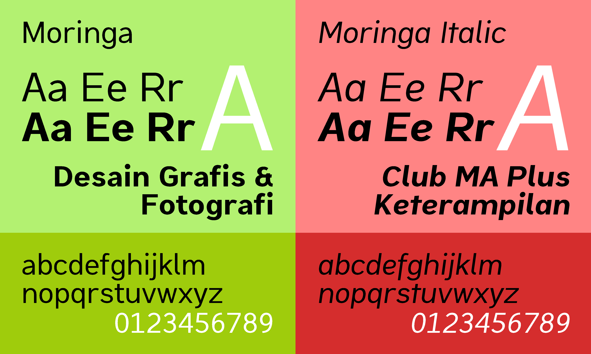

# The Moringa Font Project

## What is this?

This is a sans-serif typeface / font that is designed for publication materials by the D'Graph club. With its formal, modern look that is easy to read, this font will give a signature touch to all of your digital materials.

Main format is *Splinefont Database*, work done using the FontForge app.

> **Remember!** This font is still in the development stage. The design, parameters, and other characteristiques may change over time.

## Why Named "Moringa"?

Moringa is one of the distinguishing features of MAN Lumajang and the flagship product of the Kopsis Al Barokah (school cooperative) of MAN Lumajang. Moringa is also featured in the daily uniforms of MAN Lumajang.

## Specimen

## Download and Use This Font! <small>in your designs</small>

[Click here](https://gitlab.com/kak_hilhilll/moringa-font/-/jobs/14600235086/artifacts/download?file_type=archive) to download from Gitlab. UFO format is also available for working with other apps.

Generated automatically by Gitlab CI, on 28 May 2026

## Limitations

* Side bearings might be too wide or too narrow, depending on how this font is used
* Rhythm may be inconsistent
* Kerning to adjust character-to-character distances (e.g. between A and V) might contain errors
* Language coverage is still very limited (only English, Indonesian, and Malay for now)
* The shape of some characters may feel off because of the usage of automatic hinting

Should you have any suggestions and feedback about this font, you may open an issue in *Plan* \> *Issue boards* or in *Issues*. You can also contribute directly by opening a pull request.

> **Remember!** Active development of this project takes place on [GitLab](https://gitlab.com/kak_hilhilll/moringa-font), so opening issues and pull requests there is recommended as the authors will be most likely to be active there.

## The Licence

This font is available under the terms of SIL Open Font License, version 1.1. See LICENSE to learn more.

