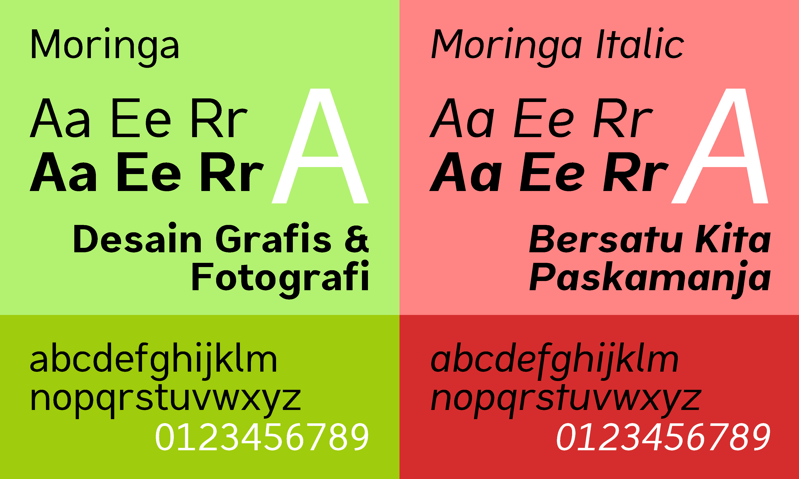

# Proyek Font Moringa

Ini adalah muka huruf (*typeface* / *font*) berjenis *sans-serif* yang didesain untuk materi publikasi oleh club D'Graph. Mengusung tampilan yang formal, modern dan nyaman dibaca, font ini memberikan tampilan yang khas untuk seluruh materi pamflet anda.

Format utama adalah *Splinefont Database*, pengerjaan dengan aplikasi FontForge.

> **Ingat!** Font ini masih dalam tahap beta / pengembangan. Desain, parameter, dan karakteristik lainnya dapat berubah sewaktu-waktu.

## Mengapa Dinamai "Moringa"?

Moringa adalah nama lain dari tanaman sayur kelor. Kelor adalah salah satu ciri khas dari MAN Lumajang dan produk unggulan Kopsis Al Barokah MAN Lumajang. Kelor juga digunakan dalam motif seragam almamater MAN Lumajang.

## Download dan Gunakan Font Ini! <small>dalam desain anda</small>

[Klik di sini](https://gitlab.com/kak_hilhilll/moringa-font/-/jobs/14582044896/artifacts/download?file_type=archive) untuk mengunduh dari Gitlab. Tersedia juga format UFO untuk pengerjaan di aplikasi lain.

Dibuat secara otomatis oleh GitLab CI, pada tanggal 28 Mei 2026

## Kekurangan *Font* Ini

* Jarak antar huruf (*side bearings*) mungkin terlalu renggang atau terlalu rapat, tergantung bagaimana *font* ini digunakan
* Ritme mungkin kurang konsisten
* *Kerning* untuk menyesuaikan jarak huruf ke huruf (seperti antara A dan V) mungkin terdapat beberapa kesalahan
* Bahasa yang dapat digunakan dengan *font* ini terbatas (saat ini hanya bahasa Inggris, Indonesia, dan Melayu)
* Bentuk beberapa karakter mungkin kurang pas karena penggunaan *hinting* otomatis

Jangan segan-segan untuk membuka isu di repositori ini jika terdapat masukan, saran, dan kritik tentang *font* ini di *Plan* \> *Issue boards* atau di *Issues*.

> **Ingat!** Pengembangan *font* ini terjadi secara aktif di [GitLab](https://gitlab.com/kak_hilhilll/moringa-font), jadi sangat disarankan untuk membuka isu di sana.

## Lisensi *Font* Ini

*Font* ini tersedia di bawah ketentuan lisensi *SIL Open Font Licence*. Baca LICENSE untuk selengkapnya.

